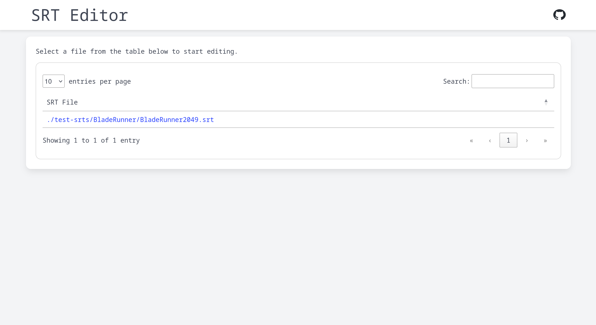
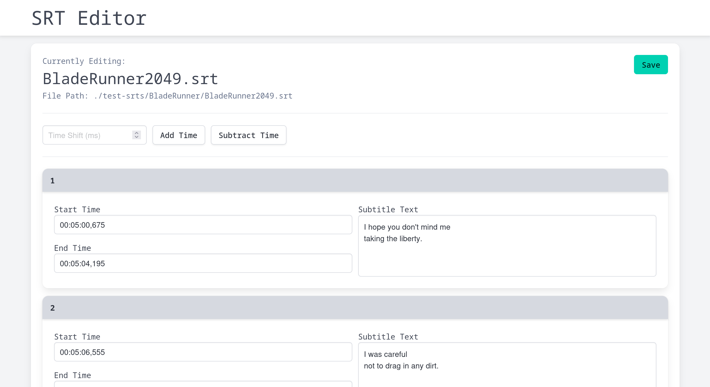

# SRT Editor

Self-hostable SRT Editor. Quickly make edits to your SRT files.





## Features and Use Case

I run a Jellyfin instance on my home server to house all my movies and TV shows. I prefer to enable subtitles when possible. When I rip Blu-Rays, I often times download the subtitles in SRT format from the internet. 

These SRT files sometimes have small errors in them. On multiple occasions, I needed to shift the subtitles forward or backward a few seconds to line up with my copy of the media. Sometimes there are punctuation or formatting errors that can be annoying.

This project aims to offer a fast way to resolve those issues. Simply point the app to a directory on the machine (via a Docker volume) and it will recursively scan for SRT subtitle files. In the web interface, you can easily access and edit those files. For my use case, I point the app to my Jellyfin movies directory on my server. I can download the subtitle file, make a few tweaks if needed, then it's good to go!

## Running Locally

Run the server locally using the Makefile command:

```sh
make dev
```

Access the application at `localhost:5000`.

## Running with Docker

Run the application inside a Docker container using the Makefile command:

```sh
make run
```

Access the application at `localhost:8080`.

## Roadmap

> [!NOTE]
> **This project is still in very early development. Expect bugs and missing features.**

Here are some features that I would like to implement in the future:
- [X] Ability to delete snippets
- [ ] Ability to create new subtitle files
- [ ] Ability to delete subtitle files
- [ ] File validation
- [ ] "Raw" editor mode to edit the whole file directly
- [ ] Better UI
